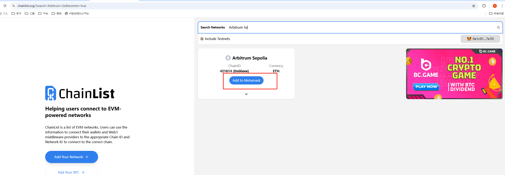
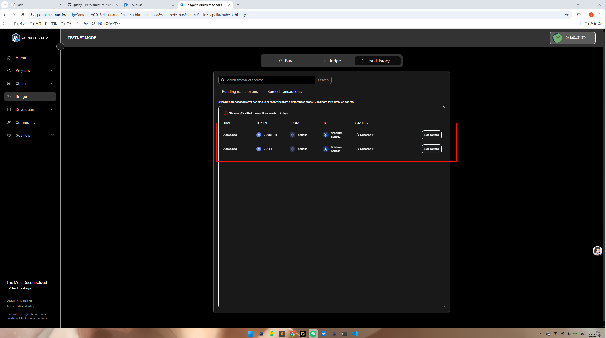
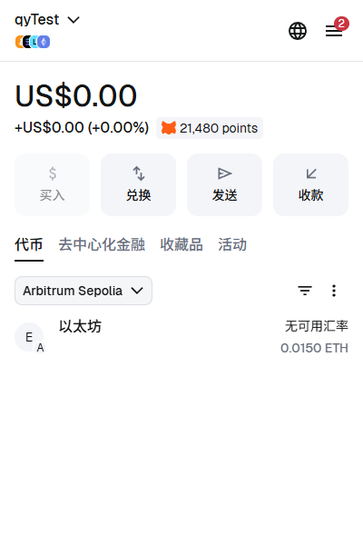
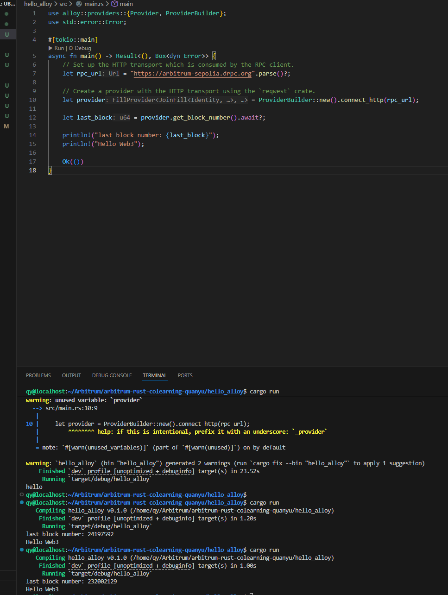
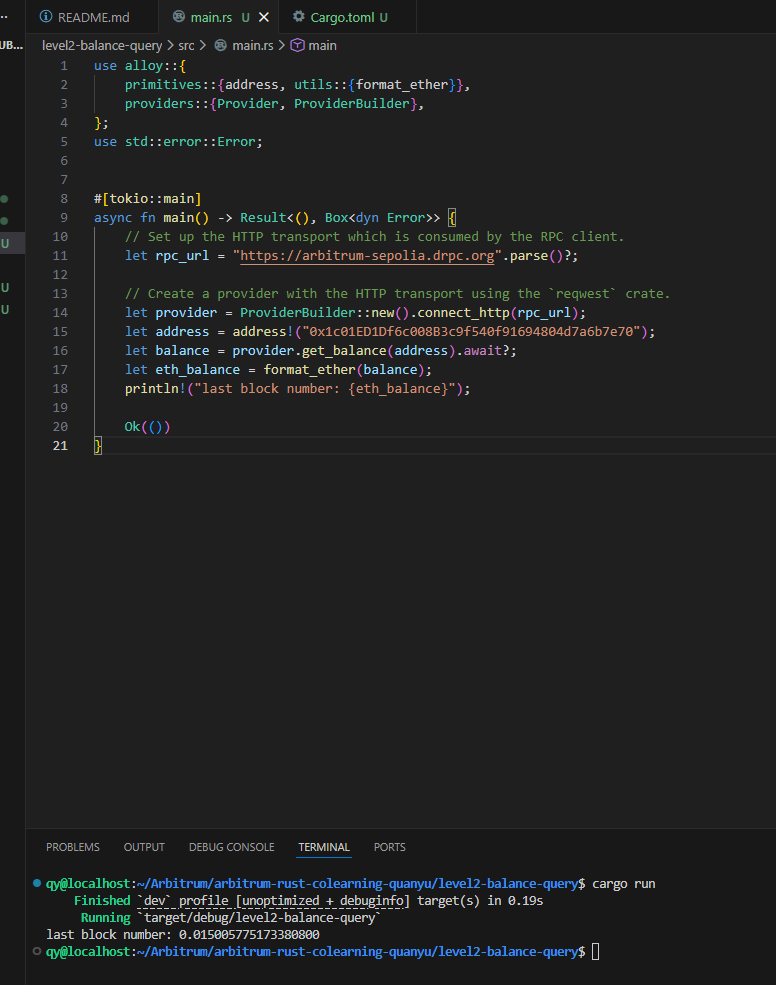
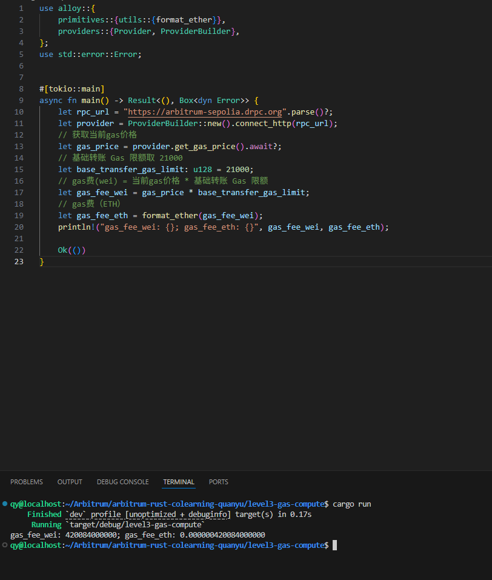

# arbitrum-rust-colearning-quanyu
arbitrum共学营个人仓库

# 作业1

1. 添加钱包：

2. 领取测试币需要主网有ETH，这里用的Arbitrum的Bridge从ETH Sepolia转过来一些：

3. 交易结果：

4. 钱包余额：

5. 作业1代码位置：

./hello_alloy/src/main.rs

6. 运行结果：

# 作业2

1. 作业2 代码位置

./level2-balance-query/src/main.rs

2. 运行结果

# 作业3

1. 作业3 代码位置

./level3-gas-compute/src/main.rs

2. 运行结果

